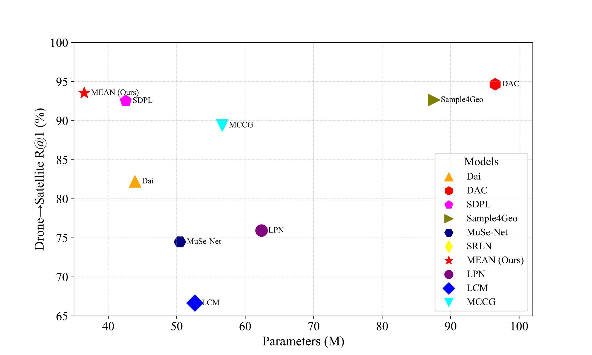

## MEAN 2024 [[paper](https://ieeexplore.ieee.org/document/11010144)][[model](https://pan.baidu.com/s/1YPEV27tnadqCZBRCscTMTA)] [[Cite](#Citation)]
<p align="center">

  <h1 align="center">Multilevel Embedding and Alignment Network With Consistency and Invariance Learning for Cross-View Geo-Localization</h1>
  <h3 align="center"><strong>Zhongwei Chen</strong>, <strong>Zhaoxu Yang*</strong>, <strong>Haijun Rong*</strong></h3>
  <div align="center">
  School of Aerospace Engineering, Xi'an Jiaotong University China<br>
  State Key Laboratory for Strength and Vibration of Mechanical Structures<br>
  Shaanxi Key Laboratory of Environment and Control for Flight Vehicle<br>
  </div>
  <p align="center">
    
  <p align="center">
  
This repository is the official implementation of the paper "Multilevel Embedding and Alignment Network With Consistency and Invariance Learning for Cross-View Geo-Localization" (https://arxiv.org/abs/2412.14819). 

The current version of the repository can cover the experiments reported in the paper, for researchers in time efficiency. And we will also update this repository for better understanding and clarity.

## <a id="news"></a> 🔥 News
- [May  17, 2025]: MEAN is accepted by TGRS'25 🎉
- [Apr  15, 2025]: We uploaded the visualization code.
- [Feb  28, 2025]: We released the **MEAN** model and its pre-trained weights.
---
## <a id="table-of-contents"></a> 📚 Table of contents

- [Dataset Access](#dataset-access)
- [Dataset Structure](#dataset-structure)
- [Train and Test](#train-and-test)
- [Pre-trained Checkpoints](#pre-trained-checkpoints)
- [License](#license)
- [Acknowledgments](#acknowledgments)
- [Citation](#citation)

## <a id="dataset-access"></a> 💾 Dataset Access
Please prepare [University-1652](https://github.com/layumi/University1652-Baseline), [SUES-200](https://github.com/Reza-Zhu/SUES-200-Benchmark)
## <a id="dataset-structure"></a> 📁 Dataset Structure

### University-1652 Dataset Directory Structure
```
├── University-1652/
│   ├── train/
│       ├── drone/                   /* drone-view training images 
│           ├── 0001
|           ├── 0002
|           ...
│       ├── satellite/               /* satellite-view training images       
│   ├── test/
│       ├── query_drone/  
│       ├── gallery_drone/  
│       ├── query_satellite/  
│       ├── gallery_satellite/ 
```
### SUES-200 Dataset Directory Structure
```
├─ SUES-200
  ├── Training
    ├── 150/
    ├── 200/
    ├── 250/
    └── 300/
  ├── Testing
    ├── 150/
    ├── 200/ 
    ├── 250/	
    └── 300/
```

## <a id="train-and-test"></a> 🚀 Train and Test

For University-1652 Dataset
```
Train: run train_university.py, with --only_test = False.

Test: run train_university.py, with --only_test = True, and choose the model in --ckpt_path.
```
For SUES-200 Dataset
```
Train: run train_SUES-200.py, with --only_test = False.

Test: run train_SUES-200.py, with --only_test = True, and choose the model in --ckpt_path.
```

## <a id="pre-trained-checkpoints"></a> 🤗 Pre-trained Checkpoints
We provide the trained models in the link below:

Baidu Netdisk Link: [https://pan.baidu.com/s/1QoYcr2XXy5z0oFh2Tzi40A?pwd=6666 提取码: 6666]

Google Drive Link: [https://drive.google.com/drive/folders/13aFkUDNzqOHAvDfaloh14RMvOuPZqi3G?usp=drive_link]
We will update this repository for better clarity ASAP, current version is for quick research for researchers interested in the cross-view geo-localization task.

## <a id="license"></a> 🎫 License
This project is licensed under the [Apache 2.0 license](LICENSE).

## <a id="citation"></a> 📌 Citation

 If you find this code useful for your research, please cite our papers.

```bibtex
@article{chen2024multi,
  author={Chen, Zhongwei and Yang, Zhao-Xu and Rong, Hai-Jun},
  journal={IEEE Transactions on Geoscience and Remote Sensing}, 
  title={Multi-Level Embedding and Alignment Network with Consistency and Invariance Learning for Cross-View Geo-Localization}, 
  year={2025},
  volume={63},
  number={},
  pages={1-15}
```

## <a id="acknowledgments"></a> 🙏 Acknowledgments
This repository is built using the [Sample4Geo](https://github.com/Skyy93/Sample4Geo), [MCCG](https://github.com/mode-str/crossview) and [DAC](https://github.com/SummerpanKing/DAC) repositories. Thanks for their wonderful work.

