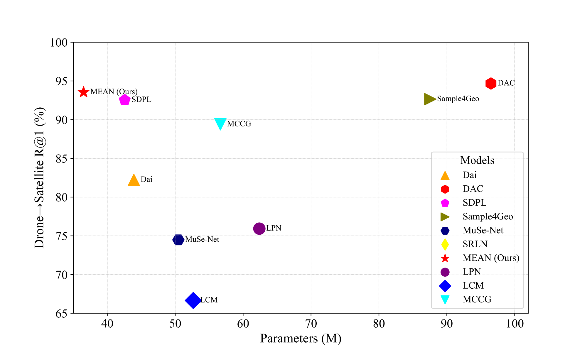

## MEAN 2024 [[Paper](https://ieeexplore.ieee.org/document/11010144)] [[Models](#pre-trained-checkpoints)] [[Cite](#citation)]

<h1 align="center">
Multilevel Embedding and Alignment Network With Consistency and Invariance Learning for Cross-View Geo-Localization
</h1>

<h3 align="center">
<strong>Zhongwei Chen</strong>,
<strong>Zhaoxu Yang*</strong>,
<strong>Haijun Rong*</strong>
</h3>

<div align="center">
School of Aerospace Engineering, Xi'an Jiaotong University, China<br>
State Key Laboratory for Strength and Vibration of Mechanical Structures<br>
Shaanxi Key Laboratory of Environment and Control for Flight Vehicle<br>
<sup>*</sup>Corresponding authors
</div>

<br>

<div align="center">
  <p>
    <a href="https://ieeexplore.ieee.org/document/11010144">
      
    </a>
    <a href="https://arxiv.org/abs/2412.14819">
      
    </a>
    <a href="#pre-trained-checkpoints">
      
    </a>
    <a href="LICENSE">
      
    </a>
  </p>
</div>

---

## <a id="motivation"></a>💡 Motivation

<p align="center">
  
</p>

This repository provides the official implementation of:

> **Multilevel Embedding and Alignment Network With Consistency and Invariance Learning for Cross-View Geo-Localization**

The implementation supports the experiments reported in the paper and provides training, evaluation, pretrained checkpoints, and visualization utilities for reproducible cross-view geo-localization research.

---

## 🔥 News

- **May 17, 2025:** MEAN was accepted by **IEEE TGRS**. 🎉
- **April 15, 2025:** Visualization code was released.
- **February 28, 2025:** MEAN code and pretrained checkpoints were released.

---

## 📚 Table of Contents

- [Overview](#-overview)
- [News](#-news)
- [Dataset Access](#-dataset-access)
- [Dataset Structure](#-dataset-structure)
- [Training and Evaluation](#-training-and-evaluation)
- [Pre-trained Checkpoints](#-pre-trained-checkpoints)
- [License](#-license)
- [Acknowledgments](#-acknowledgments)
- [Citation](#-citation)

---

## 💾 Dataset Access

Please download and prepare the following datasets:

- [University-1652](https://github.com/layumi/University1652-Baseline)
- [SUES-200](https://github.com/Reza-Zhu/SUES-200-Benchmark)

---

## 📁 Dataset Structure

### University-1652

The expected directory structure is:

```text
University-1652/
├── train/
│   ├── drone/
│   │   ├── 0001/
│   │   ├── 0002/
│   │   └── ...
│   └── satellite/
│       ├── 0001/
│       ├── 0002/
│       └── ...
└── test/
    ├── query_drone/
    ├── gallery_drone/
    ├── query_satellite/
    └── gallery_satellite/
```

### SUES-200

The expected directory structure is:

```text
SUES-200/
├── Training/
│   ├── 150/
│   ├── 200/
│   ├── 250/
│   └── 300/
└── Testing/
    ├── 150/
    ├── 200/
    ├── 250/
    └── 300/
```

---

## 🚀 Training and Evaluation

### University-1652

Use `train_university.py` for both training and evaluation.

**Training**

```bash
python train_university.py --only_test False
```

**Evaluation**

```bash
python train_university.py \
  --only_test True \
  --ckpt_path /path/to/checkpoint
```

### SUES-200

Use `train_SUES-200.py` for both training and evaluation.

**Training**

```bash
python train_SUES-200.py --only_test False
```

**Evaluation**

```bash
python train_SUES-200.py \
  --only_test True \
  --ckpt_path /path/to/checkpoint
```

> Please adjust dataset paths and other experiment-specific arguments according to your local environment and the configuration used in the repository.

---

## 🤗 Pre-trained Checkpoints

We provide pretrained MEAN checkpoints for reproducing the results reported in the paper.

### Baidu Netdisk

[Download MEAN checkpoints](https://pan.baidu.com/s/1QoYcr2XXy5z0oFh2Tzi40A?pwd=6666)

Extraction code: `6666`

### Google Drive

[Download MEAN checkpoints](https://drive.google.com/drive/folders/13aFkUDNzqOHAvDfaloh14RMvOuPZqi3G?usp=drive_link)

The downloaded checkpoint can be specified through the `--ckpt_path` argument during evaluation.

---

## 🎫 License

This project is licensed under the [Apache License 2.0](LICENSE).

---

## 🙏 Acknowledgments

This repository builds upon ideas and code from:

- [Sample4Geo](https://github.com/Skyy93/Sample4Geo)
- [MCCG](https://github.com/mode-str/crossview)
- [DAC](https://github.com/SummerpanKing/DAC)

We sincerely thank the authors for making their excellent work publicly available.

---

## 📌 Citation

If you find this work useful in your research, please cite:

```bibtex
@article{chen2025mean,
  author  = {Chen, Zhongwei and Yang, Zhao-Xu and Rong, Hai-Jun},
  title   = {Multi-Level Embedding and Alignment Network with Consistency and Invariance Learning for Cross-View Geo-Localization},
  journal = {IEEE Transactions on Geoscience and Remote Sensing},
  year    = {2025},
  volume  = {63},
  pages   = {1--15}
}
```
