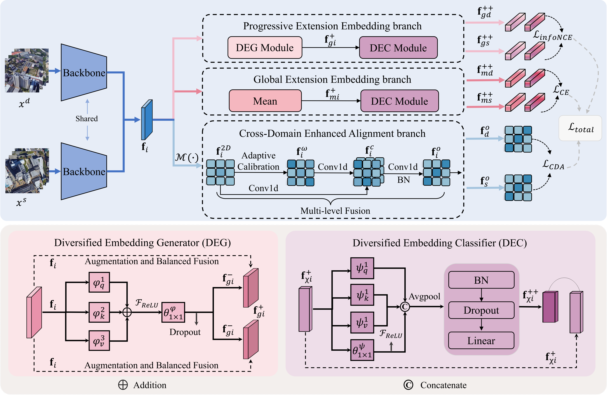

## MEAN 2024 [[paper](https://arxiv.org/abs/2412.14819)][[model](https://pan.baidu.com/s/1YPEV27tnadqCZBRCscTMTA)] [[Cite](#Citation)]
This repository is the official implementation of the paper "Multi-Level Embedding and Alignment Network with Consistency and Invariance Learning for Cross-View Geo-Localization" (https://arxiv.org/abs/2412.14819). 

The current version of the repository can cover the experiments reported in the paper, for researchers in time efficiency. And we will also update this repository for better understanding and clarity.



## <a id="table-of-contents"></a> 📚 Table of contents

- [Dataset Highlights](#dataset-highlights)
- [Dataset Access](#dataset-access)
- [Dataset Structure](#dataset-structure)
- [Train and Test](#train-and-test)
- [Pre-trained Checkpoints](#pre-trained-checkpoints)
- [License](#license)
- [Acknowledgments](#acknowledgments)
- [Citation](#citation)

## <a id="dataset-access"></a> 💾 Dataset Access

## <a id="dataset-structure"></a> 📁 Dataset Structure

## <a id="train-and-test"></a> 🚀 Train and Test

For University-1652 dataset
```
Train: run train_university.py, with --only_test = False.

Test: run train_university.py, with --only_test = True, and choose the model in --ckpt_path.
```
For SUES-200 dataset
```
Train: run train_SUES-200.py, with --only_test = False.

Test: run train_SUES-200.py, with --only_test = True, and choose the model in --ckpt_path.
```


## <a id="pre-trained-checkpoints"></a> 🤗 Pre-trained Checkpoints
We provide the trained models in the link below:

Link: [https://pan.baidu.com/s/1YPEV27tnadqCZBRCscTMTA : 6666]

We will update this repository for better clarity ASAP, current version is for quick research for researchers interested in the cross-view geo-localization task.

## <a id="license"></a> 🎫 License
This project is licensed under the [Apache 2.0 license](LICENSE).

## <a id="citation"></a> 📌 Citation

 If you find this code useful for your research, please cite our papers.

```bibtex
@article{chen2024multi,
  title={Multi-Level Embedding and Alignment Network with Consistency and Invariance Learning for Cross-View Geo-Localization},
  author={Chen, Zhongwei and Yang, Zhao-Xu and Rong, Hai-Jun},
  journal={arXiv preprint arXiv:2412.14819},
  year={2024}
}
```

## <a id="acknowledgments"></a> 🙏 Acknowledgments
This repository is built using the Sample4Geo[https://github.com/Skyy93/Sample4Geo], MCCG[https://github.com/mode-str/crossview] and DAC [https://github.com/SummerpanKing/DAC] repositories.

